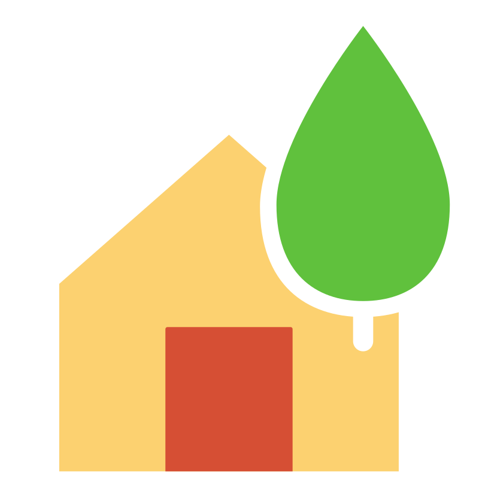

# It's backend for _"ProjectFlour"_ app

## Description
App have next functions/features:
- Users can register and login
- Users can to get all permitted information
- Users can to get notifications about updated information(WebSocket)
- Users can to update information using Excel
- App has own database (**PostgreSQL**)
- App has own API (**GO-CHI**)
- App has own web-server (**Nginx**). Please check [Frontend](https://github.com/DeMarDeXis/ProjectF-TEST-front-) repository for more information.
- App has own WebSocket server (**Gorilla**)

Whole project was written using Golang and was deployed on Selectel using Docker and CI/CD by GitHub Actions.